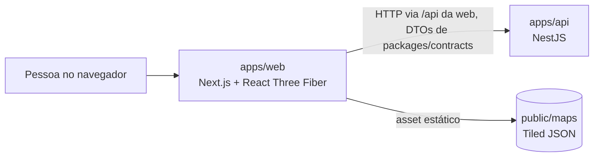
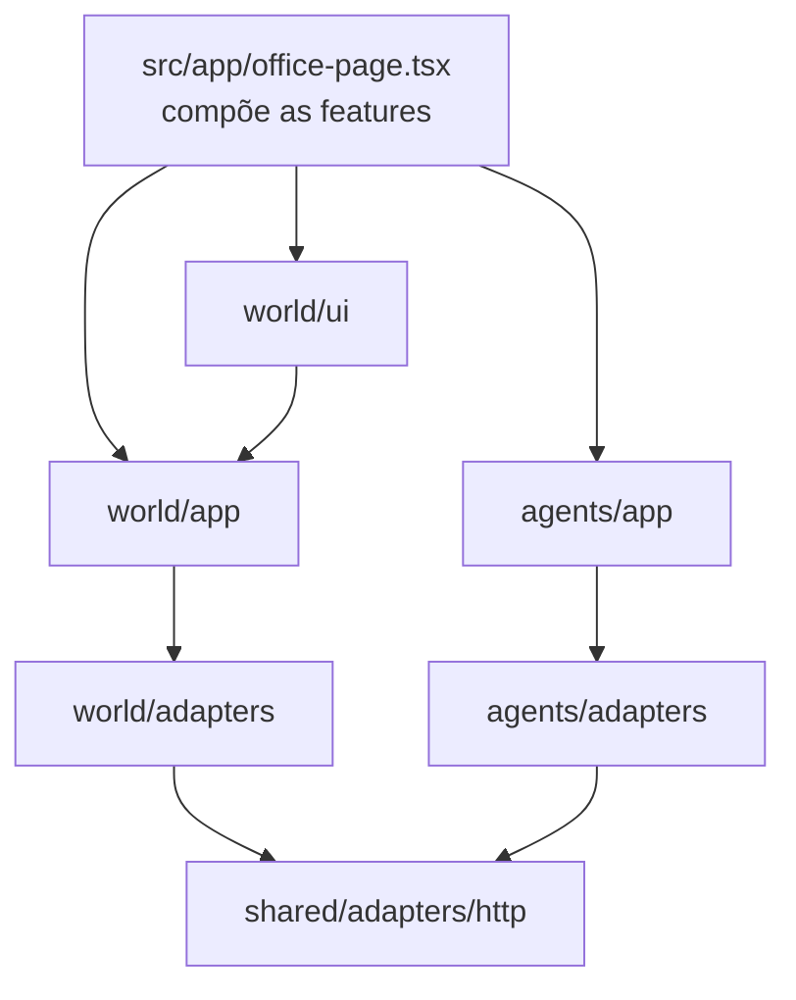

# Arquitetura

## Contexto

Hoje a API guarda tudo em memória. Postgres entra na fase 4, Redis e WebSocket na fase 5 (ver [ROADMAP](ROADMAP.md)).

## API: um hexágono por contexto

| Contexto | Agregado                                    | Casos de uso             | Portas               |
| -------- | ------------------------------------------- | ------------------------ | -------------------- |
| `world`  | `WorldMap` (com `WorldEntity` e `Position`) | `GetWorldMap`            | `WorldMapRepository` |
| `agents` | `Agent`                                     | `ListAgents`, `GetAgent` | `AgentRepository`    |

| Camada         | Contém                                                       | Pode importar                                       |
| -------------- | ------------------------------------------------------------ | --------------------------------------------------- |
| `domain/`      | entidades e value objects imutáveis, validados no construtor | o próprio domínio e `shared/domain`                 |
| `application/` | casos de uso e portas (interfaces)                           | o anterior, a própria camada e `shared/application` |
| `adapters/`    | módulo Nest, controller HTTP, repositório em memória, seed   | tudo                                                |

- Referência entre contextos é por identificador: `WorldEntity` guarda `agentId`, nunca um `Agent`.
- Casos de uso lançam `NotFoundError`; o filtro `NotFoundFilter` em `shared/adapters` vira 404.
  O caso de uso nunca conhece HTTP.
- Injeção explícita por classe ou símbolo (`@Inject`), sem depender de metadado de tipo: o mesmo
  código roda no build com SWC e nos testes do Vitest.

## Web: camadas por funcionalidade

- `domain`: só tipos (`GridMap`, `WorldScene`, `Agent`).
- `app`: lógica pura (colisão, proximidade, montagem da cena em tiles) e hooks com TanStack Query.
- `adapters`: HTTP, leitura do formato do Tiled, teclado. Único lugar com `fetch` e com DTOs do contrato.
- `ui`: React Three Fiber e HUD. Único lugar com `three` e `@react-three/*`.
- O mundo pede um rótulo por `agentId` a quem compõe a página; nunca importa a feature `agents`.

## Mundo 3D leve

- O layout é um grid 2D editado no Tiled (`public/maps/office.json`). Cada tile da camada `walls`
  vira um bloco 3D com `height`, `color` e `collides` das propriedades do tileset.
- Chão e blocos são dois `instancedMesh`: o mapa inteiro custa 2 draw calls.
- Colisão é círculo contra grid, eixo a eixo (o personagem desliza na parede), sem motor de física.
- Movimento e câmera em `useFrame` com refs. O React só renderiza quando muda o NPC próximo.
- Sem shadow maps (sombra é um disco), sem tone mapping, pixel ratio limitado a 1,5, câmera fixa alta.
- React Compiler ligado: sem `useMemo`/`useCallback` escritos à mão por desempenho.

## Qualidade

- **Arquitetura por AST**, nos dois apps: lê cada import e recusa o que atravessa camada ou contexto.
- **Domínio por propriedade** com fast-check: `Position` nunca negativa, o personagem nunca
  termina dentro de parede, diagonal anda na mesma velocidade que reta.
- **Contrato de porta**: uma suíte por porta em `apps/api/test/contracts/`, que todo adaptador roda.
- **Rotas com a composição real**: Nest, casos de uso e adaptadores juntos, via supertest.
- **Componentes 3D** com `@react-three/test-renderer`: o jogador anda com o teclado de verdade
  (`user-event`), para na parede e no NPC, e avisa a proximidade.
- **Ponta a ponta** com Playwright sobre o build de produção, WebGL por SwiftShader.
- **Cobertura com piso** no Vitest de cada app: 100% na API e, na web, o que a suíte alcança hoje arredondado para baixo. O piso só sobe.
- **ESLint** `strictTypeChecked` + `stylisticTypeChecked`, regras de import por camada, Prettier,
  TypeScript com `noUncheckedIndexedAccess` e `exactOptionalPropertyTypes`.
- **Hook `commit-msg`** recusa assunto fora do Conventional Commits e trailer de ferramenta de IA.
- **CI** (`.github/workflows/ci.yml`, a adicionar): portão rápido, build e ponta a ponta em todo PR.
